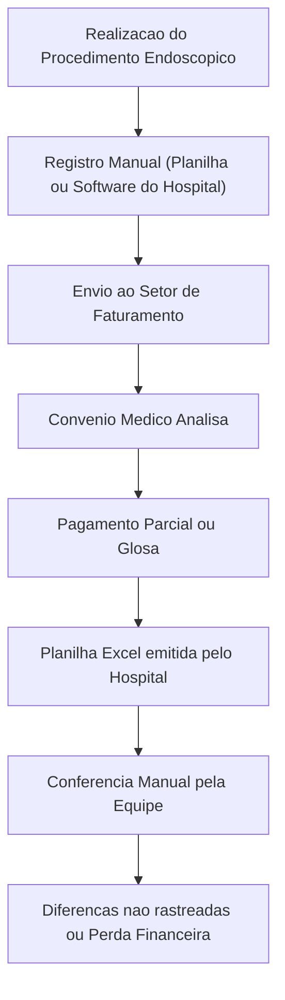
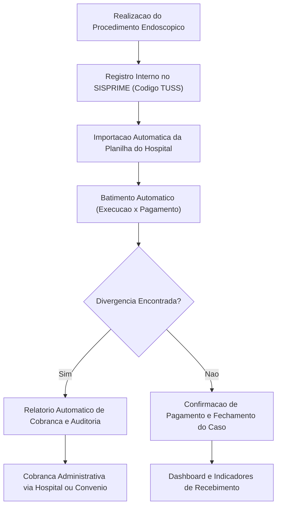
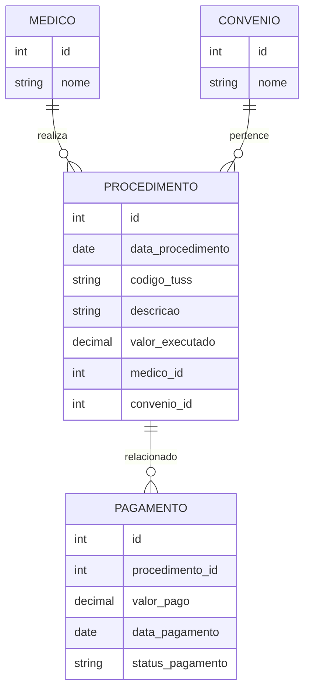

# 🩺 Projeto: Sistema de Controle e Validação de Procedimentos Médicos Endoscópicos (SISPRIME)

## 1. Contexto

A equipe de endoscopistas utiliza atualmente uma ferramenta interna do hospital para registrar os procedimentos realizados, identificando-os através de códigos **TUSS (Terminologia Unificada da Saúde Suplementar)**.  
Apesar disso, há divergências recorrentes entre o que é efetivamente realizado e o que é **faturado e pago pelos convênios médicos**.  

Essas divergências resultam em **glosas**, **pagamentos parciais** ou até **perdas financeiras**, devido à dificuldade de rastrear e comprovar o que foi realmente executado.

O hospital fornece periodicamente **planilhas Excel** com os registros processados e os pagamentos recebidos, mas a conferência manual é trabalhosa, sujeita a erros e não permite visão consolidada das diferenças.

---

## 2. Objetivo do Projeto

Desenvolver uma **solução interna de controle e validação dos procedimentos endoscópicos**, que:

- Centralize o **registro dos procedimentos** realizados (via código TUSS).
- Faça o **batimento automático** entre os procedimentos realizados e os valores faturados/pagos pelos convênios.
- Gere **alertas e relatórios** de divergência.
- Permita **cobrança estruturada** junto ao hospital e convênios para correção dos pagamentos.
- Ofereça **indicadores financeiros e operacionais** para suporte à gestão médica e administrativa.

---

## 3. Situação Atual (Antes da Solução)

---

## 4. Situação Proposta (Após Implantação do SISPRIME)

---

## 5. Escopo Funcional

### Módulos Principais
1. **Cadastro de Procedimentos**
   - Registro de dados do exame: data, paciente, código TUSS, médico responsável, convênio e valor esperado.
   - Importação de dados a partir de sistemas hospitalares (CSV/Excel).

2. **Importação de Pagamentos**
   - Leitura automática das planilhas Excel emitidas pelo hospital.
   - Mapeamento e tratamento de campos relevantes (ex: código TUSS, valor pago, status da glosa).

3. **Batimento Automático**
   - Comparação entre os registros internos e os arquivos hospitalares.
   - Identificação de divergências (ausência, diferença de valor, glosa parcial).

4. **Relatórios e Dashboards**
   - Resumo por convênio, tipo de exame e período.
   - Visualização de discrepâncias e pendências de cobrança.

5. **Auditoria e Cobrança**
   - Geração automática de relatórios de divergência.
   - Exportação em formato Excel/PDF para envio ao setor financeiro.

---

## 6. Estrutura de Dados Sugerida

| Campo | Descrição | Origem | Tipo de Dado |
|-------|------------|--------|---------------|
| `id_procedimento` | Identificador interno do procedimento | Sistema | Numérico |
| `data_procedimento` | Data de realização do exame | Manual/Importação | Data |
| `codigo_tuss` | Código TUSS do procedimento | Manual/Importação | Texto |
| `descricao` | Descrição do procedimento | Manual | Texto |
| `medico_responsavel` | Nome do endoscopista | Manual | Texto |
| `convenio` | Nome do convênio médico | Manual/Importação | Texto |
| `valor_executado` | Valor do procedimento conforme tabela TUSS | Manual | Numérico |
| `valor_pago` | Valor recebido conforme planilha hospitalar | Importado | Numérico |
| `status_pagamento` | Pago, Glosado, Pendente | Calculado | Texto |
| `data_pagamento` | Data de crédito do convênio | Importado | Data |
| `observacao` | Observações gerais | Manual | Texto |

---

## 7. Requisitos Técnicos

- **Front-end:** ReactAdmin com Vite (interface web simples, responsiva)
- **Back-end:** Python (FastAPI)
- **Banco de Dados:** DynamoDB
- **Importação de Planilhas:** uso de bibliotecas como `pandas` (Python) ou `xlsx` (Node.js)
- **Autenticação:** integração com sistema interno do hospital (LDAP ou SSO)
- **Hospedagem:** AWS Lambda ou container Docker dentro da infraestrutura hospitalar
- **Relatórios:** exportação em Excel, PDF e visualização via dashboard web

---

## 8. Indicadores Esperados

| Indicador | Objetivo | Benefício |
|------------|-----------|------------|
| % de divergência identificada | Medir eficácia da validação | Reduzir perdas financeiras |
| Tempo médio de conferência | Avaliar eficiência do processo | Automatizar tarefas manuais |
| Valor recuperado por mês | Mensurar resultado financeiro | Aumentar receita médica |
| Taxa de glosas reincidentes | Identificar padrões | Corrigir causas recorrentes |

---

## 9. Modelo de Entidades (ERD Simplificado)

---

## 10. Benefícios do Projeto

- **Redução de glosas e perdas financeiras.**
- **Visibilidade total** sobre o ciclo do faturamento endoscópico.
- **Agilidade na cobrança** e comunicação com convênios.
- **Base de dados consolidada** para tomada de decisão e auditoria.
- **Escalabilidade:** o mesmo modelo pode ser aplicado a outras especialidades médicas.

---

## 11. Próximos Passos

1. Levantamento detalhado dos campos presentes nas planilhas hospitalares.  
2. Definição do modelo de dados e regras de batimento.  
3. Prototipação da interface e fluxos de uso.  
4. Desenvolvimento incremental (MVP em 4 a 6 semanas).  
5. Teste piloto com a equipe de endoscopistas.  
6. Ajustes e implantação completa.

---

> 📘 **Resumo:**  
> O SISPRIME permitirá controle e auditoria de todo o ciclo de faturamento de procedimentos endoscópicos, integrando dados clínicos e financeiros para reduzir divergências e maximizar o recebimento dos serviços prestados.
